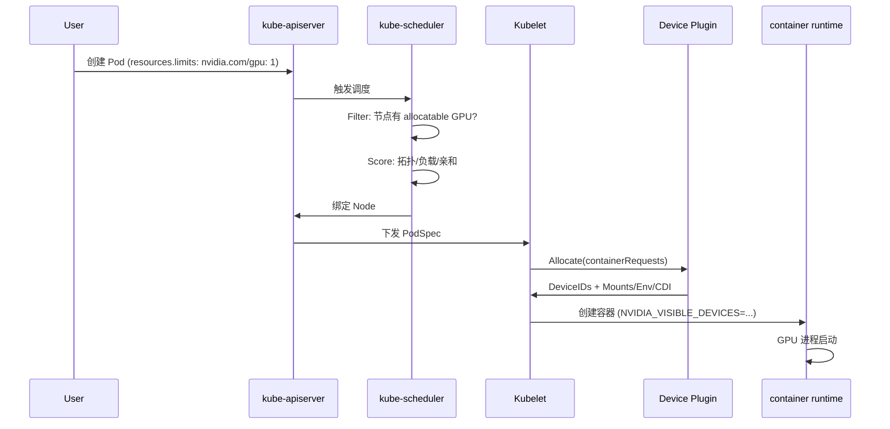

# M1: GPU 调度全链路

> 目标：从 `kubectl apply` 到 GPU 被进程占用，画出完整数据流

## 1. 与 CPU 调度的关键差异

| 维度 | CPU/Memory | GPU |
|------|------------|-----|
| 资源类型 | 可压缩 (compressible) | **不可压缩** (整卡/整 MIG slice) |
| 调度粒度 | millicore | 整卡 或 厂商自定义 fraction |
| 发现机制 | kubelet 内置 cgroups | **Device Plugin** gRPC |
| 分配时机 | kubelet 创建容器时 | Allocate → CDI/env → runtime |
| 拓扑约束 | NUMA (可选) | **PCIe/NVLink/NVSwitch** 强相关 |
| 共享模型 | 天然共享 | 需 MIG/Time-Slicing/MPS/HAMi 等 |

## 2. 完整调度路径（必须背下来）



### 2.1 关键对象

```yaml
# Node 上的 GPU 资源（Device Plugin 上报）
status:
  allocatable:
    nvidia.com/gpu: "8"
  capacity:
    nvidia.com/gpu: "8"

# Pod 请求
resources:
  limits:
    nvidia.com/gpu: 1   # Extended Resource，不可 overcommit
```

### 2.2 调度器视角

kube-scheduler 对 GPU 的处理与普通 Extended Resource **几乎相同**：

1. **Filter 阶段**：`NodeResourcesFit` 插件检查 `pod.spec.containers[].resources.limits`
2. **Score 阶段**：默认无 GPU 拓扑感知（需自定义 Plugin）
3. **Reserve/PreBind**：1.26+ 可选，用于外部资源预留

> 核心认知：**标准 scheduler 只认 `nvidia.com/gpu` 数量，不认 GPU 型号、NVLink 拓扑、显存余量**

## 3. Device Plugin 协议（精简版）

Device Plugin 通过 Unix Socket 与 kubelet 通信：

```
/var/lib/kubelet/device-plugins/nvidia.com/gpu.sock
```

| RPC | 方向 | 作用 |
|-----|------|------|
| `ListAndWatch` | DP → kubelet | 上报可用 Device 列表，变化时推送 |
| `Allocate` | kubelet → DP | 为容器分配具体 GPU UUID |
| `GetPreferredAllocation` | kubelet → DP | (可选) 拓扑感知分配建议 |

Allocate 返回内容示例：

```json
{
  "containerResponses": [{
    "envs": {
      "NVIDIA_VISIBLE_DEVICES": "GPU-abc123"
    },
    "mounts": [{
      "containerPath": "/dev/nvidia0",
      "hostPath": "/dev/nvidia0"
    }]
  }]
}
```

K8s 1.28+ 推荐 **CDI (Container Device Interface)** 替代 env+mount 方式。

## 4. 实验：观察调度链路（Lab 1）

### Lab 1A: 无 GPU 集群 — 理解 Pending 原因

```bash
kubectl apply -f labs/M1/gpu-pod.yaml
kubectl describe pod gpu-test
# 观察 Events: Insufficient nvidia.com/gpu
```

### Lab 1B: 有 GPU 集群 — 追踪分配

```bash
# 一键排查（支持批量 Pod）
./labs/M1/debug-commands.sh gpu-test
./labs/M1/debug-commands.sh gpu-test-0 gpu-test-1 gpu-test-2
./labs/M1/debug-commands.sh -n training worker-0 worker-1

# 节点上验证
nvidia-smi  # 应看到对应进程
```

### Lab 1C: 调度决策追踪（K8s 1.23+）

```bash
kubectl apply -f labs/M1/gpu-pod-with-scheduling-gates.yaml
kubectl get events --field-selector involvedObject.name=gpu-test -w
```

## 5. 思考题（先自己想，再对答案）

<details>
<summary>Q1: 为什么 GPU 是 Extended Resource 而不是 Device Class？</summary>

Extended Resource 是 K8s 早期方案，简单但功能有限（只能整数、不可 overcommit）。
Device Class (DRA, Dynamic Resource Allocation) 是 1.26+ 新方案，支持更细粒度分配，
但 NVIDIA 生态目前仍以 Device Plugin 为主。
</details>

<details>
<summary>Q2: 两个 Pod 各请求 1 GPU，节点有 8 卡，scheduler 如何保证它们在同一 NVLink domain？</summary>

默认 **不能保证**。标准 scheduler 只看数量。需要：
- Node Feature Discovery + GPU Feature Discovery 打 label
- 自定义 Scheduler Plugin 读取拓扑 label
- 或使用 Volcano 的 GPU topology policy
</details>

<details>
<summary>Q3: Pod 被调度后 GPU 分配失败会怎样？</summary>

kubelet 会在 SyncLoop 中重试 Allocate。持续失败则 Pod 进入
`ContainerCreating` 或 `Failed`，Events 中可见 device plugin 错误。
</details>

## 6. M1 完成标准

- [ ] 能不看文档画出 Mermaid 调度序列图
- [ ] 能解释 `Insufficient nvidia.com/gpu` 的完整排查路径
- [ ] 能在集群中定位 Device Plugin DaemonSet 并读日志
- [ ] 完成 Lab 1A/1B（或 1C）
- [ ] 在 `notes/M1-summary.md` 写 1 页总结

## 7. 推荐阅读

- [K8s Device Plugins](https://kubernetes.io/docs/concepts/extend-kubernetes/compute-storage-net/device-plugins/)
- [NVIDIA k8s-device-plugin README](https://github.com/NVIDIA/k8s-device-plugin)
- K8s 源码: `pkg/scheduler/framework/plugins/noderesources/fit.go`

---

**下一步**: 完成 M1 后回复 **"完成 M1"**，进入 M2 Device Plugin 深入 + 本地实验。
