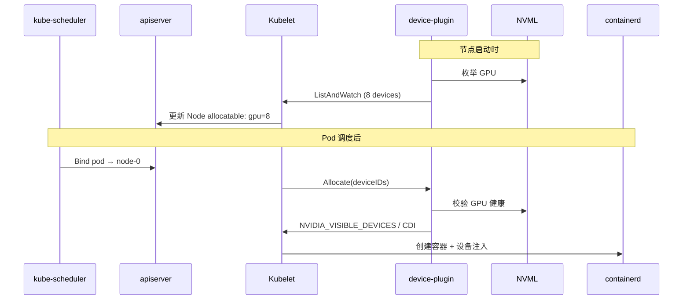

# M2: Device Plugin & GPU Operator

> 目标：理解 scheduler 绑定节点之后，GPU 是如何被「交给容器」的

## 与 M1 的衔接

```
M1 结束点: scheduler 写入 pod.spec.nodeName
M2 起点:   kubelet 在目标节点调用 Device Plugin.Allocate()
M2 终点:   容器内可见 GPU (nvidia-smi / NVIDIA_VISIBLE_DEVICES)
```

---

## 1. Device Plugin 协议（精读）

### 1.1 通信方式

```
kubelet                          Device Plugin (DaemonSet Pod)
  │                                      │
  │──── gRPC Unix Socket ────────────────│
  │   /var/lib/kubelet/device-plugins/   │
  │   nvidia.com/gpu.sock                  │
  │                                      │
  │◄── ListAndWatch (stream) ────────────│  上报设备列表
  │──── Allocate ────────────────────────►│  分配具体设备
  │◄── ContainerAllocateResponse ────────│  env/mounts/CDI
```

### 1.2 三个核心 RPC

| RPC | 调用方 | 作用 |
|-----|--------|------|
| `ListAndWatch` | kubelet 发起 | DP 持续推送 `[]*Device`，设备增减时重新推送 |
| `Allocate` | kubelet 发起 | 为容器分配 Device ID，返回注入方式 |
| `GetPreferredAllocation` | kubelet 发起 (可选) | 拓扑感知时给出分配建议 |

### 1.3 Device 对象

```go
type Device struct {
    ID     string       // 如 "GPU-0dea264c-..." 或 "nvidia0"
    Health string       // "Healthy" | "Unhealthy"
    Topology *TopologyInfo  // NUMA / PCIe 拓扑 (可选)
}
```

kubelet 把 `ListAndWatch` 返回的设备数汇总为 Node 的 `capacity/allocatable.nvidia.com/gpu`。

---

## 2. NVIDIA k8s-device-plugin 源码导读

仓库: https://github.com/NVIDIA/k8s-device-plugin

### 2.1 启动流程

```
main()
  → 读取配置 (ConfigMap / 命令行 flags)
  → 检测 NVML (libnvidia-ml.so) 枚举 GPU
  → 注册到 kubelet: /var/lib/kubelet/device-plugins/nvidia.com/gpu.sock
  → 启动 ListAndWatch goroutine
```

### 2.2 ListAndWatch — 设备发现

**你要找的代码**: `internal/plugin/server.go` → `ListAndWatch()`

核心逻辑:

```go
// 伪代码
func (m *NvidiaDevicePlugin) ListAndWatch(empty *Empty, stream DevicePlugin_ListAndWatchServer) error {
    for {
        devices := m.apiDevices()   // NVML 枚举 GPU, 过滤 MIG/健康状态
        stream.Send(&ListAndWatchResponse{Devices: devices})
        <-m.healthUpdate          // 等设备健康变化再推送
    }
}
```

**关键 flags**:

| Flag | 作用 |
|------|------|
| `--mig-strategy` | `none` / `single` / `mixed` — MIG 设备上报策略 |
| `--device-list-strategy` | `env` / `volume-mounts` / `cdi` / `envvar` |
| `--pass-device-specs` | 是否传递 DeviceSpec (mounts) |

### 2.3 Allocate — 设备分配

**你要找的代码**: `internal/plugin/server.go` → `Allocate()`

```go
// 伪代码
func (m *NvidiaDevicePlugin) Allocate(req *AllocateRequest) (*AllocateResponse, error) {
    for _, container := range req.Containers {
        devs := container.DevicesIDs
        // 校验 ID 合法、健康
        response := buildAllocateResponse(devs, m.config.DeviceListStrategy)
        // env: NVIDIA_VISIBLE_DEVICES=GPU-uuid1,GPU-uuid2
        // cdi: 生成 CDI spec 注入
    }
}
```

### 2.4 三种注入方式对比

| 策略 | 注入内容 | K8s 版本 | 推荐度 |
|------|----------|----------|--------|
| `env` | `NVIDIA_VISIBLE_DEVICES=GPU-xxx` | 全版本 | 传统默认 |
| `volume-mounts` | mount `/dev/nvidia*` | 全版本 | 部分场景 |
| `cdi` | Container Device Interface spec | 1.28+ | **新集群推荐** |

容器 runtime (containerd) 根据 Allocate 返回的 response 完成最终设备注入。

---

## 3. GPU Operator 组件矩阵

```
┌─────────────────────────────────────────────────────────┐
│                    NVIDIA GPU Operator                   │
├─────────────┬───────────────────────────────────────────┤
│ node-driver │ GPU 驱动 (bare metal 通常跳过)             │
│ device-plugin│ 上报 nvidia.com/gpu, 处理 Allocate       │
│ gfd         │ GPU Feature Discovery → 节点 labels        │
│ mig-manager │ MIG 分区配置 (ConfigMap 驱动)              │
│ dcgm-exp    │ Prometheus GPU 指标                        │
│ validator   │ 部署后自检 (CUDA vectorAdd)                │
│ sandbox-    │ vGPU / 虚拟化 (可选)                       │
│ device-plugin│                                          │
└─────────────┴───────────────────────────────────────────┘
```

### 3.1 各组件职责

| 组件 | DaemonSet? | 产出 |
|------|-----------|------|
| **device-plugin** | ✅ 每 GPU 节点 | `nvidia.com/gpu` Extended Resource |
| **gpu-feature-discovery (GFD)** | ✅ 每 GPU 节点 | `nvidia.com/gpu.product`, `nvidia.com/mig.capable` 等 labels |
| **mig-manager** | ✅ 每 GPU 节点 | 按 ConfigMap 切分 MIG, 上报 `nvidia.com/mig-1g.5gb` 等 |
| **dcgm-exporter** | ✅ 每 GPU 节点 | `DCGM_FI_DEV_GPU_UTIL` 等指标 |
| **node-feature-discovery (NFD)** | ✅ 每节点 | CPU/内核/PCI 等通用 labels (Operator 依赖) |

### 3.2 GFD 产生的关键 Labels

```yaml
# kubectl get node <gpu-node> --show-labels
nvidia.com/gpu.product: NVIDIA-A100-SXM4-80GB
nvidia.com/gpu.memory: 81920
nvidia.com/gpu.count: "8"
nvidia.com/mig.capable: "true"
nvidia.com/mig.strategy: single
```

这些 labels 是 M1 中 `nodeSelector` 的数据来源，也是 M4 拓扑调度 Plugin 的输入。

---

## 4. 完整数据流（M1 + M2 合体）



---

## 5. Lab 指南

### Lab 2A: 真实集群巡检（推荐，需 BOE GPU 节点）

```bash
./labs/M2/inspect-device-plugin.sh
./labs/M2/inspect-gpu-labels.sh
```

观察清单:
- [ ] device-plugin DaemonSet 是否 Running
- [ ] socket 文件是否存在
- [ ] ListAndWatch 日志中的 GPU 数量
- [ ] GFD labels 是否齐全
- [ ] 部署 GPU Pod 后 `NVIDIA_VISIBLE_DEVICES` 值

### Lab 2B: 读源码（本地，无需 GPU）

```bash
# 克隆仓库
git clone --depth=1 https://github.com/NVIDIA/k8s-device-plugin.git /tmp/k8s-device-plugin

# 跟读路径
# 1. cmd/nvidia-device-plugin/main.go
# 2. internal/plugin/server.go  → ListAndWatch, Allocate
# 3. internal/cdi/              → CDI 注入逻辑
```

跟读问题:
1. `ListAndWatch` 什么条件下会重新推送?
2. `Allocate` 如何校验请求的 Device ID?
3. `cdi` 策略和 `env` 策略分支在哪里?

### Lab 2C: kind 集群部署 DP（可选，预期失败但可观察）

```bash
kubectl apply -f labs/M2/nvidia-device-plugin-kind.yaml
kubectl logs -n kube-system -l app=nvidia-device-plugin-daemonset
# 预期: NVML error (no GPU) — 理解 DP 对硬件的依赖
```

---

## 6. 故障排查手册

| 现象 | 排查 |
|------|------|
| Node 无 `nvidia.com/gpu` | DP Pod 是否 Running? NVML 是否可用? |
| Pod ContainerCreating 卡住 | `kubectl describe pod` → Events; DP logs |
| Pod 无 `NVIDIA_VISIBLE_DEVICES` | `--device-list-strategy` 是否为 cdi? containerd CDI 是否启用? |
| GPU 数量不对 | MIG strategy? `--gpu-devices` 限制? |
| 分配了错误的卡 | 无 GetPreferredAllocation 时 DP 按序分配 |

---

## 7. 思考题

<details>
<summary>Q1: Device Plugin 挂了，已运行的 GPU Pod 会怎样?</summary>

已运行的容器不受影响（设备已注入）。但 Node 的 allocatable GPU 会变为 0，
新 Pod 无法调度到该节点，直到 DP 恢复并重新 ListAndWatch。
</details>

<details>
<summary>Q2: 为什么 GFD 不合并进 Device Plugin?</summary>

职责分离: DP 负责资源分配 (kubelet 协议)，GFD 负责节点标注 (NFD 生态)。
GFD 产出的 labels 供 scheduler 使用，DP 不参与调度决策。
</details>

<details>
<summary>Q3: CDI 相比 env 注入的优势?</summary>

- 不依赖环境变量传递，更安全
- 支持更复杂的设备组合 (GPU + IMEX 等)
- containerd/CRI-O 原生支持，是 K8s 1.28+ 推荐方向
</details>

---

## 8. M2 完成标准

- [ ] 能解释 ListAndWatch → allocatable → Allocate 完整链路
- [ ] 能在集群中定位 DP/GFD Pod 并读日志
- [ ] 能说出 GPU Operator 6 个核心组件的职责
- [ ] 完成 Lab 2A 或 Lab 2B
- [ ] 填写 `notes/M2-summary.md`

---

**下一步**: 完成 Lab 后回复 **「完成 M2」**，进入 M3 GPU 共享与切分。
