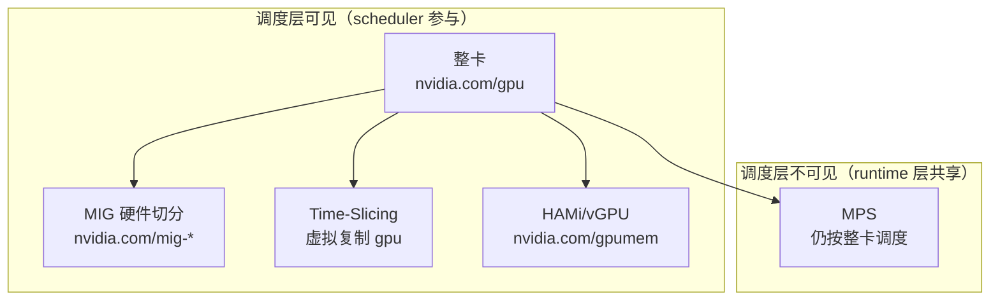

# M3: GPU 共享与切分

> 目标：理解「整卡分配」之外，如何在 K8s 层实现 GPU 共享，以及各方案的工程取舍

## 从 M2 出发

M2 学到：Device Plugin 通过 NVML 枚举 GPU，`ListAndWatch` 上报离散 Device 列表，scheduler 按**整数**分配。

**本模块要解决的问题**：一张物理卡，如何让多个 Pod 安全/高效地共用？

---

## 1. 五种方案总览



| 方案 | 隔离性 | 调度粒度 | K8s 资源名 | 实现方 | 适用 |
|------|--------|----------|------------|--------|------|
| **整卡** | 强 | 1 GPU | `nvidia.com/gpu` | 默认 DP | 大模型训练 |
| **MIG** | 硬件级 | slice | `nvidia.com/mig-1g.5gb` | DP + mig-manager | 推理混部 (A100+) |
| **Time-Slicing** | ❌ 无 | 虚拟 N 份 | 同名 `nvidia.com/gpu` | DP ConfigMap | 轻量推理 |
| **MPS** | 中 | 整卡 | `nvidia.com/gpu` | MPS Daemon + sidecar | 小 kernel 高并发 |
| **HAMi/vGPU** | 软 | 显存/算力% | `nvidia.com/gpumem` | 第三方 DP | 国内云常见 |

---

## 2. Time-Slicing — 虚拟复制，无隔离

### 原理

Device Plugin 把 **1 张物理卡复制成 N 个虚拟 Device** 上报给 kubelet：

```
物理: 1 × A100
配置 replicas: 4
上报: nvidia.com/gpu = 4

Pod-A 请求 gpu:1 → 分到 annotated-GPU-0-replica-0
Pod-B 请求 gpu:1 → 分到 annotated-GPU-0-replica-1
Pod-C 请求 gpu:1 → 分到 annotated-GPU-0-replica-2
Pod-D 请求 gpu:1 → 分到 annotated-GPU-0-replica-3

4 个 Pod 实际共享同一张物理卡，分时执行
```

源码（你读过的 `device_map.go`）：

```go
for i := 0; i < r.Replicas; i++ {
    annotatedID := NewAnnotatedID(id, i)  // 同一张卡，不同虚拟 ID
}
```

### 配置

```yaml
# nvidia-device-plugin ConfigMap
apiVersion: v1
kind: ConfigMap
metadata:
  name: nvidia-device-plugin-config
data:
  config.yaml: |
    sharing:
      timeSlicing:
        resources:
          - name: nvidia.com/gpu
            replicas: 4
```

### 关键认知

| ✅ 能做到 | ❌ 做不到 |
|----------|----------|
| 提高调度利用率（更多 Pod 能「调度上来」） | **显存隔离**（Pod-A OOM 会拖垮 Pod-B） |
| 零额外组件，DP 原生支持 | 算力公平保证 |
| 配置简单 | 故障隔离 |

> **Time-Slicing 解决的是「调度器以为有很多卡」，不是「安全共享一张卡」。**

---

## 3. MIG — 硬件级切分

### 原理

NVIDIA A100/H100 支持将 1 张卡切成多个独立实例（MIG Instance）：

```
物理: 1 × A100-80GB
MIG 配置: 7 × 1g.5gb (各 5GB 显存)

Device Plugin 上报:
  nvidia.com/gpu: 0              ← 整卡不再上报
  nvidia.com/mig-1g.5gb: 7       ← 7 个独立 slice
```

### 组件

```
GPU Operator
├── mig-manager        # 按 ConfigMap 配置 MIG 分区
├── device-plugin      # 上报 mig-* 资源而非整卡
└── gpu-feature-discovery  # 打 mig.capable 等 label
```

### Pod 请求

```yaml
resources:
  limits:
    nvidia.com/mig-1g.5gb: 1    # 只要 1 个 5GB slice
```

### MIG 策略 (`--mig-strategy`)

| 策略 | 行为 |
|------|------|
| `none` | 只上报整卡，忽略 MIG |
| `single` | 所有 GPU 必须统一 MIG 配置，只上报 MIG slice |
| `mixed` | 部分 GPU 开 MIG、部分整卡，分别上报 |

### 关键认知

| ✅ 优势 | ⚠️ 代价 |
|--------|--------|
| 硬件级显存/算力隔离 | 改 MIG 配置需 **drain 节点** |
| scheduler 原生支持（Extended Resource） | 只有 Ampere+ (A100/A30) 支持 |
| 故障隔离（一个 slice 崩不影响其他） | MIG 规格固定，灵活性有限 |

---

## 4. MPS — CUDA 多进程服务

### 原理

```
scheduler 仍按整卡调度:
  Pod-A: nvidia.com/gpu: 1  → node-0, GPU-0
  Pod-B: nvidia.com/gpu: 1  → node-0, GPU-1

实际: 通过 MPS daemon，多个 CUDA 进程共享 GPU 上下文
  → 减少 context switch 开销
  → 提高小 kernel 并发效率
```

### 架构

```
节点上:
  nvidia-mps-control-daemon (DaemonSet)
    ↓
  每个 GPU Pod 内:
    mps-client sidecar 或 env 配置
    CUDA_MPS_PIPE_DIRECTORY=/tmp/nvidia-mps
```

### 关键认知

- **scheduler 不知道 MPS 存在**——仍按整卡分配
- 适合：大量小 batch 推理、CUDA kernel 很轻的场景
- 不适合：大模型训练（整卡都占不满）

---

## 5. HAMi / vGPU — 软件切分

### 原理

替换或扩展 Device Plugin，上报 **fraction 资源**：

```yaml
resources:
  limits:
    nvidia.com/gpumem: 4000      # 4GB 显存
    nvidia.com/gpucores: 30       # 30% 算力
```

Device Plugin 在 Allocate 时做**软件级限制**（内核 hook / CUDA interceptor）。

### 对比

| | MIG | HAMi/vGPU |
|--|-----|-----------|
| 隔离 | 硬件 | 软件 |
| 粒度 | 固定规格 (1g.5gb) | 灵活 (任意 %） |
| 硬件要求 | A100+ | 较广 |
| 稳定性 | 高 | 依赖实现质量 |
| 生态 | NVIDIA 官方 | 国内云（火山、阿里等）|

---

## 6. 决策树

```
你的场景？
│
├─ 大模型训练（7B+）
│   └─→ 整卡，不做共享
│
├─ 推理服务混部（多个模型）
│   ├─ 有 A100/H100 → MIG ✅
│   └─ 无 MIG 硬件   → HAMi/vGPU 或 Time-Slicing（接受风险）
│
├─ 轻量推理，容忍无隔离
│   └─→ Time-Slicing
│
├─ 大量小 kernel 并发
│   └─→ MPS + 整卡调度
│
└─ 需要显存%级灵活切分
    └─→ HAMi/vGPU
```

---

## 7. 三个关键问题

<details>
<summary>Q1: Time-Slicing 为什么不能解决显存隔离？</summary>

Time-Slicing 只在 Device Plugin 层**复制虚拟 Device ID**，Allocate 时多个 Pod 仍指向**同一张物理卡**。
NVML / CUDA 层面没有做任何显存限制——Pod-A 可以用满 80GB，Pod-B 直接 OOM。

隔离需要硬件 (MIG) 或软件 hook (HAMi) 在更底层介入。
</details>

<details>
<summary>Q2: MIG 变更为什么需要 drain 节点？</summary>

MIG 分区是**硬件级重构**——把 1 张 A100 从「整卡模式」切成 7 个 slice 需要：
1. 杀掉所有 GPU 进程
2. 通过 NVML 重新配置 GPU 实例
3. Device Plugin 重新 ListAndWatch

运行中的 Pod 会丢 GPU，所以必须先驱逐 (drain)。
</details>

<details>
<summary>Q3: 混部时 scheduler 如何防止 GPU 显存 OOM？</summary>

**标准 scheduler 不能。** 它只看资源数量，不看显存余量。

防 OOM 需要额外机制：
- **MIG**: 硬件硬限制，scheduler 按 slice 调度即可
- **HAMi**: Device Plugin + Webhook 校验显存配额
- **自定义 Scheduler Plugin**: 读 DCGM 指标，拒绝超配节点
- **生产实践**: 靠 limit 配置 + 监控告警，而非 scheduler 预防
</details>

---

## 8. Lab 指南

### Lab 3A: 观察 Time-Slicing 配置（本地/kind）

```bash
# 查看当前 DP 配置
kubectl get cm -n kube-system nvidia-device-plugin-config -o yaml

# 应用 Time-Slicing 配置
kubectl apply -f labs/M3/time-slicing-config.yaml
kubectl rollout restart ds/nvidia-device-plugin-daemonset -n kube-system

# 观察虚拟 GPU 数量变化
kubectl get nodes -o jsonpath='{.items[*].status.allocatable.nvidia\.com/gpu}'
```

### Lab 3B: MIG 资源观察（需 A100+ 节点）

```bash
./labs/M3/inspect-mig.sh
```

### Lab 3C: 共享方案对比实验（KWOK 模拟）

```bash
kubectl apply -f labs/M3/kwok-sharing-scenarios.yaml
./labs/M1/debug-commands.sh gpu-whole gpu-timeslice-1 gpu-timeslice-2 gpu-mig-slice
```

---

## 9. M3 完成标准

- [ ] 能说出 5 种共享方案的区别和适用场景
- [ ] 能解释 Time-Slicing 「虚报」与真实物理卡的关系
- [ ] 能解释 MIG 为什么需要 drain
- [ ] 完成 Lab 3A 或 3C
- [ ] 填写 `notes/M3-summary.md`

---

**下一步**: 完成 Lab 后回复 **「完成 M3」**，进入 M4 调度器扩展（GPU 拓扑 Score Plugin）。
