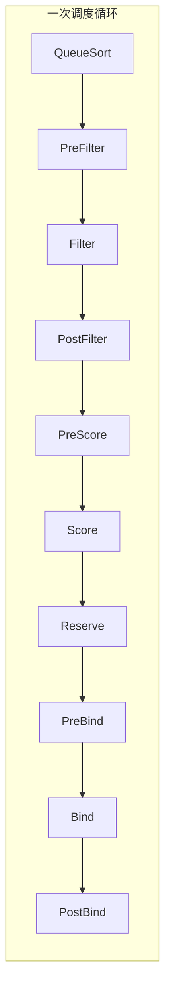

# M4: 调度器扩展

> 目标：理解标准 scheduler 对 GPU 的局限，掌握扩展调度能力的工程手段

## 从 M3 出发的问题

M3 学到：整卡 / MIG / Time-Slicing 解决「一张卡怎么分给多个 Pod」。

M4 要解决的问题：

| 问题 | 标准 scheduler 能管吗？ |
|------|------------------------|
| 8 卡 AllReduce 训练，卡在同一 NVLink domain？ | ❌ |
| 2 卡 Pod 的两张卡必须在同一节点？ | ❌（默认不保证） |
| 8 卡节点跑了 7 个 1 卡 Pod，8 卡 Job 进不来？ | ❌（碎片） |
| 推理 Pod 尽量 Spread 到不同 GPU 节点？ | ⚠️ 仅 topologySpreadConstraints |
| 按 GPU 型号（A100 vs T4）调度？ | ⚠️ 仅 nodeSelector |

---

## 1. Scheduling Framework 架构



| 扩展点 | 作用 | GPU 相关例子 |
|--------|------|--------------|
| **Filter** | 排除不满足的节点 | `NodeResourcesFit`：GPU 数量够不够 |
| **Score** | 给节点打分，选最优 | GPU 拓扑亲和、Bin Packing |
| **Reserve** | 预留资源（1.26+） | 外部 GPU 资源预留 |
| **PreBind** | Bind 前最后检查 | DRA Driver 确认设备 |

标准 scheduler 对 GPU **只在 Filter 阶段**通过 `NodeResourcesFit` 检查数量。

---

## 2. 标准 scheduler 的 GPU 行为

```go
// k8s.io/kubernetes/pkg/scheduler/framework/plugins/noderesources/fit.go
// 伪代码
func Fits(pod, node) bool {
    for resource, requested := range pod.Resources {
        if node.Allocatable[resource] - node.Allocated[resource] < requested {
            return false  // Insufficient nvidia.com/gpu
        }
    }
    return true
}
```

**不看的**：GPU 型号、NVLink 拓扑、显存余量、已分配设备的物理位置。

---

## 3. GPU 调度扩展的三层手段

```
Layer 1: 原生 K8s（无需改 scheduler）
  ├── nodeSelector / nodeAffinity     → 选 GPU 型号
  ├── podAffinity / podAntiAffinity   → 多 Pod 同节点/不同节点
  └── topologySpreadConstraints       → 分散到不同节点

Layer 2: 自定义 Scheduler Plugin（改 kube-scheduler）
  ├── GPU Topology Score              → NVLink domain 亲和
  ├── GPU Bin Packing Score           → 减少碎片
  └── Coscheduling / Gang             → 见 M5 Volcano

Layer 3: 外部调度器
  ├── Volcano                         → Gang + Queue + GPU topology
  └── Kueue                           → Queue + Preemption
```

M4 重点：**Layer 1 实验 + Layer 2 原理与骨架**。

---

## 4. Layer 1: 原生 K8s 调度约束

### 4.1 nodeSelector — 选 GPU 型号

GFD 打的 label：

```yaml
nodeSelector:
  nvidia.com/gpu.product: NVIDIA-A100-SXM4-80GB
```

M1 Lab 已验证。

### 4.2 podAffinity — 多卡 Pod 必须在同一节点

8 卡训练常拆成 8 个 1 卡 Pod（MPIJob），需要**同节点**：

```yaml
affinity:
  podAffinity:
    requiredDuringSchedulingIgnoredDuringExecution:
      - labelSelector:
          matchLabels:
            job: llm-train
        topologyKey: kubernetes.io/hostname
```

### 4.3 topologySpreadConstraints — 推理 Spread

```yaml
topologySpreadConstraints:
  - maxSkew: 1
    topologyKey: kubernetes.io/hostname
    whenUnsatisfiable: DoNotSchedule
    labelSelector:
      matchLabels:
        app: inference
```

### 4.4 拓扑 label（GFD / NFD 提供）

```yaml
# 节点 labels（生产由 GPU Feature Discovery 注入）
nvidia.com/gpu.product: NVIDIA-A100-SXM4-80GB
nvidia.com/gpu.count: "8"
nvidia.com/gpu.memory: "81920"
# 自定义 topology labels（部分集群有）
nvlink.com/domain: "0"
```

---

## 5. Layer 2: 自定义 Score Plugin 骨架

完整骨架见 `labs/M4/gpu-topology-score-plugin-skeleton.go`。

核心逻辑：

```go
func (pl *GPUTopologyScore) Score(ctx, state, pod, nodeName) (int64, *Status) {
    gpuRequest := totalGPURequest(pod)
    if gpuRequest <= 1 {
        return 0, nil  // 单卡不需要拓扑
    }

    node := getNode(nodeName)
    freeGPUs := node.Allocatable["nvidia.com/gpu"] - node.Allocated["nvidia.com/gpu"]

    // 策略 1: Bin Packing — 优先选剩余 GPU 少的节点（减碎片）
    if pl.strategy == "binpack" {
        return maxScore - freeGPUs, nil
    }

    // 策略 2: Spread — 优先选剩余 GPU 多的节点
    if pl.strategy == "spread" {
        return freeGPUs, nil
    }

    // 策略 3: Topology — 多卡 Pod 偏好 NVLink 全连接 domain
    if node.Labels["nvlink.com/domain"] != "" && freeGPUs >= gpuRequest {
        return 100, nil
    }

    return 0, nil
}
```

### 部署自定义 Plugin 的方式

| 方式 | 说明 |
|------|------|
| **Scheduler Framework** | 编译进 kube-scheduler 或 out-of-tree 插件 .so |
| **Scheduler Extender** | HTTP 回调（遗留，不推荐新项目） |
| **Volcano** | 内置 GPU topology policy |
| **二次调度** | 先默认调度，Descheduler 重调度 |

---

## 6. GPU 碎片问题

```
节点 8 卡 A100:
  Pod-A: 1 卡  Pod-B: 1 卡  ...  Pod-H: 1 卡  → 8/8 满，但都是 1 卡 Pod

8 卡 Job 请求 gpu:8 → Insufficient（没有单节点 8 空闲）
→ 实际物理卡都在，但「凑不齐」8 张在同一节点
```

解决思路：

| 方案 | 机制 |
|------|------|
| Bin Packing Score Plugin | 优先填满节点，留空节点给大 Job |
| Descheduler | 驱逐小 Pod，给大 Job 腾位 |
| Volcano Gang | 8 卡 Job 要么全调度，要么 Pending |
| 队列配额 | Megatron / Kueue 控制提交节奏 |

---

## 7. Lab 指南

### Lab 4A: nodeAffinity + podAffinity（KWOK，本地）

```bash
kubectl apply -f labs/M4/kwok-topology-nodes.yaml
kubectl apply -f labs/M4/multi-gpu-pod-affinity.yaml
./labs/M1/debug-commands.sh train-worker-0 train-worker-1
```

### Lab 4B: topologySpreadConstraints

```bash
kubectl apply -f labs/M4/inference-spread.yaml
kubectl get pods -o wide
```

### Lab 4C: 读 scheduler 源码

```bash
./labs/M4/read-scheduler-plugins.sh
```

### Lab 4D: 读 GPU Score Plugin 骨架

```bash
cat labs/M4/gpu-topology-score-plugin-skeleton.go
```

---

## 8. 思考题

<details>
<summary>Q1: 为什么 8 个 1 卡 Pod 调度成功后，8 卡 Job 反而 Pending？</summary>

标准 scheduler 逐 Pod 独立调度，不做全局规划。7 个 1 卡 Pod 占满 7 张后，剩余 1 张不够 8 卡 Job。
需要 Bin Packing 策略或 Gang Scheduling（M5）预防。
</details>

<details>
<summary>Q2: nodeSelector 和自定义 Score Plugin 的区别？</summary>

nodeSelector 是硬约束（Filter 阶段，不满足直接排除）；
Score Plugin 是软偏好（多个节点都满足时，选分高的）。
</details>

<details>
<summary>Q3: Volcano 和自定义 Plugin 怎么选？</summary>

- 需要 Gang/Queue/Preemption → Volcano（M5）
- 只需拓扑/Bin Packing → 自定义 Score Plugin 或 Volcano gpu-topology
- 已有 Kueue 队列 → Kueue + 原生约束，不一定改 scheduler
</details>

---

## 9. M4 完成标准

- [ ] 能画出 Scheduling Framework 的 Filter/Score 阶段
- [ ] 能写出 podAffinity 保证同节点调度
- [ ] 能解释 GPU 碎片成因和 Bin Packing 思路
- [ ] 完成 Lab 4A 或 4B
- [ ] 阅读 Score Plugin 骨架代码
- [ ] 填写 `notes/M4-summary.md`

---

**下一步**: 完成 Lab 后回复 **「完成 M4」**，进入 M5 批调度（Volcano/Kueue Gang Scheduling）。
