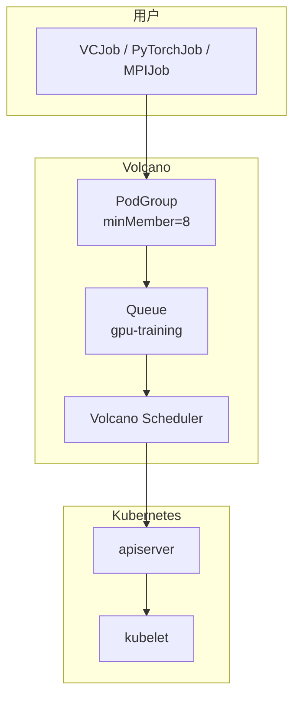
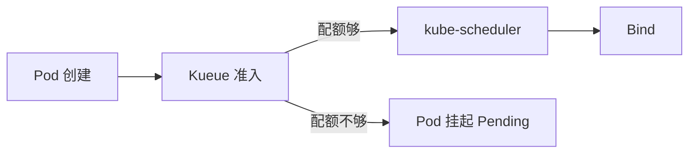

# M5: 批调度 & 队列

> 目标：理解 Gang Scheduling、队列配额，以及 Volcano/Kueue 如何解决 M4 遗留的「8 卡 Job 必须同时调度」问题

## 从 M4 遗留的问题出发

M4 学到：标准 scheduler **逐 Pod 独立调度**，会导致：

```
场景: 8 卡节点
  7 个 1 卡推理 Pod 已 Running
  8 卡训练 Job（8 个 worker，各 1 卡）提交
  → 只能调度 1 个 worker，其余 7 个 Pending
  → 训练 hang 住（AllReduce 等不齐）
```

**Gang Scheduling** = 要么全部调度，要么全部 Pending。

---

## 1. 标准 scheduler 的局限

| 需求 | 标准 kube-scheduler | Volcano / Kueue |
|------|---------------------|-----------------|
| **Gang Scheduling** | ❌ 逐 Pod 调度 | ✅ PodGroup minMember |
| **队列 / 配额** | 仅 PriorityClass | ✅ Queue CRD |
| **Job 级优先级** | ❌ | ✅ |
| **抢占策略** | 基础 | ✅ 可定制 |
| **公平调度** | ❌ | ✅ DRF / Bin Pack |

---

## 2. Volcano 架构



### 核心 CRD

**PodGroup** — Gang 语义：

```yaml
apiVersion: scheduling.volcano.sh/v1beta1
kind: PodGroup
metadata:
  name: llm-train-8gpu
spec:
  minMember: 8              # 至少 8 个 Pod 同时调度
  queue: gpu-training
  minResources:
    nvidia.com/gpu: 8       # 总共需要 8 卡
```

**Queue** — 队列配额：

```yaml
apiVersion: scheduling.volcano.sh/v1beta1
kind: Queue
metadata:
  name: gpu-training
spec:
  weight: 1
  capability:
    nvidia.com/gpu: 64      # 队列最多 64 卡
  deserved:
    nvidia.com/gpu: 32      # 保证配额
```

**VCJob** — Volcano Job（可选，也可用 PyTorchJob/MPIJob）：

```yaml
apiVersion: batch.volcano.sh/v1alpha1
kind: Job
metadata:
  name: llm-train
spec:
  schedulerName: volcano    # 关键：使用 Volcano scheduler
  minAvailable: 8
  queue: gpu-training
  tasks:
    - replicas: 8
      name: worker
      template:
        spec:
          containers:
            - name: train
              resources:
                limits:
                  nvidia.com/gpu: 1
```

### Gang 调度流程

```
1. 用户创建 PodGroup (minMember=8) + 8 个 Pod
2. Volcano scheduler 收到 Pod，检查 PodGroup
3. Filter: 有没有节点能同时容纳 8 个 Pod？
4. 有 → 8 个 Pod 同时 Bind
5. 没有 → 8 个 Pod 全部 Pending（不会部分调度）
```

---

## 3. Kueue 架构（K8s 原生队列）

Kueue 是 SIG 项目，**不替换 scheduler**，而是在调度前做**准入控制**：



**ClusterQueue** + **LocalQueue**：

```yaml
apiVersion: kueue.x-k8s.io/v1beta1
kind: ClusterQueue
metadata:
  name: gpu-cluster-queue
spec:
  resourceGroups:
    - coveredResources: ["nvidia.com/gpu"]
      flavors:
        - name: default
          resources:
            - name: nvidia.com/gpu
              nominalQuota: 64
---
apiVersion: kueue.x-k8s.io/v1beta1
kind: LocalQueue
metadata:
  name: gpu-training
  namespace: default
spec:
  clusterQueue: gpu-cluster-queue
```

Pod 通过 label 关联队列：

```yaml
metadata:
  labels:
    kueue.x-k8s.io/queue-name: gpu-training
```

### Volcano vs Kueue

| | Volcano | Kueue |
|--|---------|-------|
| **定位** | 批调度 **scheduler 替代品** | **准入队列**，仍用 kube-scheduler |
| **Gang** | ✅ PodGroup 原生 | ✅ Workload (JobSet/Job) |
| **队列** | Queue CRD | ClusterQueue + LocalQueue |
| **生态** | Kubeflow/MPIJob/PyTorchJob | JobSet, Ray, 原生 Job |
| **复杂度** | 替换 scheduler，较重 | 增量安装，较轻 |
| **适用** | 训练集群、HPC | 多租户 GPU 配额管理 |

---

## 4. 三层队列体系（结合你司环境）

```
┌─────────────────────────────────────────────────┐
│  Megatron 物理队列                               │
│  集群级 CPU/Memory/GPU 配额                       │
│  batch/compute-23-hl-federationyodel-...         │
└────────────────────┬────────────────────────────┘
                     │
┌────────────────────▼────────────────────────────┐
│  Volcano / Kueue 队列                            │
│  K8s 层 Gang + 优先级 + 配额                      │
│  Queue: gpu-training / ClusterQueue               │
└────────────────────┬────────────────────────────┘
                     │
┌────────────────────▼────────────────────────────┐
│  kube-scheduler / Volcano Scheduler              │
│  单 Pod Filter/Score → 节点                        │
└────────────────────┬────────────────────────────┘
                     │
┌────────────────────▼────────────────────────────┐
│  Device Plugin                                   │
│  Allocate → GPU 注入                               │
└─────────────────────────────────────────────────┘
```

| 层级 | 管什么 | 例子 |
|------|--------|------|
| **Megatron** | 物理队列 CPU/Mem/GPU 总量 | 缩容/扩容 federationyodel 队列 |
| **Volcano/Kueue** | K8s Job 排队、Gang、优先级 | 8 卡 Job 等配额 |
| **Scheduler** | 单 Pod 选节点 | Filter GPU 数量 |
| **Device Plugin** | 具体哪张卡 | Allocate |

---

## 5. Lab 指南

### Lab 5A: Gang 问题复现（KWOK，无需 Volcano）

```bash
kubectl apply -f labs/M5/gang-problem-demo.yaml
./labs/M5/observe-gang-problem.sh
```

观察：7 个推理 Pod 占满 7 卡后，训练 Job 的 worker 只能部分调度。

### Lab 5B: Volcano PodGroup（需安装 Volcano）

```bash
# 安装 Volcano
kubectl apply -f https://raw.githubusercontent.com/volcano-sh/volcano/master/installer/volcano-development.yaml

# 部署 Gang Job
kubectl apply -f labs/M5/volcano-gang-job.yaml
kubectl get podgroup,queue
```

### Lab 5C: 对比观察

```bash
./labs/M5/compare-schedulers.sh
```

---

## 6. 思考题

<details>
<summary>Q1: 为什么 Gang Scheduling 不能靠 podAffinity 实现？</summary>

podAffinity 只能保证「在一起」，不能保证「同时」。第 1 个 Pod 调度后，第 2-8 个可能因资源不足 Pending，导致部分 Running。
Gang 要求 scheduler **预判**：8 个都能调度才一起 Bind。
</details>

<details>
<summary>Q2: Volcano 和 Kueue 怎么选？</summary>

- 需要替换 scheduler、深度批调度、MPIJob 生态 → Volcano
- 已有 kube-scheduler、只需队列配额 + Gang → Kueue
- 两者可共存（不同 namespace 用不同方案）
</details>

<details>
<summary>Q3: Megatron 队列和 Volcano Queue 有什么区别？</summary>

Megatron 管**物理资源池**（集群级 CPU/Mem/GPU 上限）；
Volcano Queue 管 **K8s 内 Job 排队和 Gang**。
一个 Job 既要过 Volcano Queue 准入，也受 Megatron 物理队列总量约束。
</details>

---

## 7. M5 完成标准

- [ ] 能解释 Gang Scheduling 问题和 All-or-Nothing 语义
- [ ] 能写出 PodGroup + Queue YAML
- [ ] 能对比 Volcano vs Kueue vs 标准 scheduler
- [ ] 完成 Lab 5A
- [ ] 填写 `notes/M5-summary.md`

---

**下一步**: 完成 Lab 后回复 **「完成 M5」**，进入 M6 生产级专题（GPUTide 潮汐、碎片、可观测性）。
