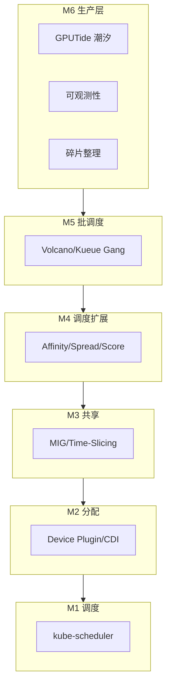
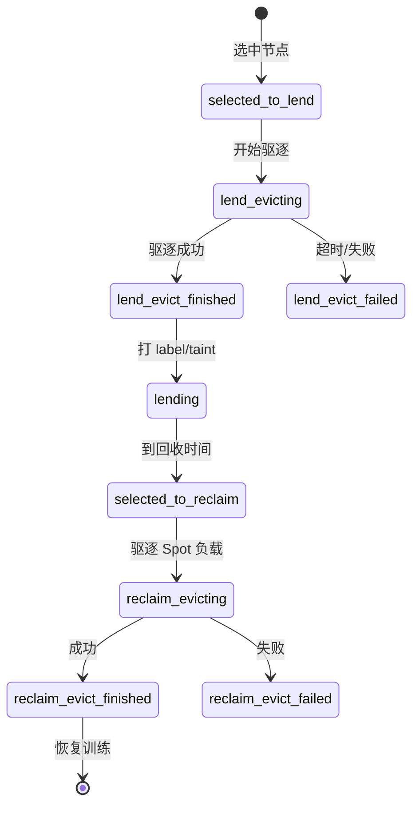

# M6: 生产级专题

> 最后一模块：把 M1-M5 串成生产全景，按痛点选专题深潜

## 全景回顾：GPU 调度六层



---

## 6.1 GPU 拓扑感知

### 问题

8 卡 AllReduce 训练，卡分布在不同 NUMA / NVLink domain → 通信性能差 30-50%。

### 数据来源

| 组件 | 产出 |
|------|------|
| **NFD** | PCI、NUMA、内核版本 |
| **GFD** | `nvidia.com/gpu.product`, `gpu.count`, `gpu.memory` |
| **自定义** | `nvlink.com/domain`, `nvidia.com/gpu.nvlink` |

### 调度手段

```yaml
# 硬约束：必须 A100
nodeSelector:
  nvidia.com/gpu.product: NVIDIA-A100-SXM4-80GB

# 多卡同节点
affinity:
  podAffinity:
    requiredDuringSchedulingIgnoredDuringExecution:
      - labelSelector:
          matchLabels:
            job: llm-train
        topologyKey: kubernetes.io/hostname

# 自定义 Score Plugin（M4）: 偏好 NVLink 全连接 domain
```

### 生产检查

```bash
kubectl get nodes -l nvidia.com/gpu.product --show-labels | grep nvlink
```

---

## 6.2 GPU 碎片整理

### 问题（M4/M5 已见）

```
8 卡节点: 7×1卡 Pod Running → 8卡 Job Pending
根因: 不是没 GPU，是凑不齐 8 张在同一节点
```

### 解决矩阵

| 方案 | 层级 | 机制 |
|------|------|------|
| **Bin Packing Score** | M4 Plugin | 优先填满节点 |
| **Volcano Gang** | M5 | 8 卡 Job 全调度或全 Pending |
| **Descheduler** | M6 | 驱逐小 Pod，给大 Job 腾位 |
| **队列限流** | M5 Kueue | 控制 1 卡 Job 提交量 |
| **整卡预留** | 运维 | taint 保留节点给大 Job |

### Descheduler 思路

```
1. 检测碎片节点（allocatable 有卡但凑不齐 N 卡）
2. 驱逐低优先级 1 卡 Pod
3. 触发大 Job 重新调度
```

---

## 6.3 潮汐 / Spot 调度（GPUTide）

### 业务场景

离线训练集群白天借给在线业务，夜间回收跑批训练——**提高 GPU 利用率**。

### 你司 GPUTidePolicy CRD

两种策略：

| 类型 | 粒度 | 场景 |
|------|------|------|
| `tideByNode` | 整机出借/回收 | 整节点划给 Spot 业务 |
| `tideByPod` | 按 Pod label 驱逐 | 精细驱逐特定工作负载 |

### 出借状态机



### 关键 Label

```yaml
kubeflow.io/gpu-tide-phase: lending          # 当前阶段
kubeflow.io/gpu-tide-selected-by: policy-x  # 被哪个 Policy 选中
kubeflow.io/evict-start-timestamp: "..."    # 驱逐开始时间
```

### 与 K8s 调度的关系

```
GPUTide Controller（上层）
  → 驱逐 Pod / 打 taint / 改 label
  → 影响节点 allocatable 和 scheduler Filter
  → 新 Pod 不再调度到出借节点

kube-scheduler（不感知 GPUTide）
  → 只看 Node 当前 label/taint/allocatable
```

### 驱逐超时策略

| 策略 | 行为 |
|------|------|
| `forceDelete` | 超时强制删 Pod |
| `justWaiting` | 继续等 |
| `alwaysTryEvict` | 重试驱逐 |

---

## 6.4 可观测性

### 三层指标

| 层级 | 指标 | 来源 |
|------|------|------|
| **分配率** | `allocatable` vs `allocated` GPU | kubelet / Node status |
| **利用率** | `DCGM_FI_DEV_GPU_UTIL` | DCGM Exporter |
| **调度健康** | Pending Pod 数、调度失败 Events | kube-scheduler |

### 关键差距：分配率 ≠ 利用率

```
分配率 90%：90% 的 GPU 被 Pod 占着
利用率 30%：占着的 GPU 实际只跑了 30% 算力
→ 70% 的 GPU 在「空转」→ 潮汐/共享/降配的信号
```

你本地的 gtspot 报表就是这个思路：对比 supply vs usage，找低利用率队列。

### 调度失败根因分类

| Event 关键词 | 根因 | 排查 |
|-------------|------|------|
| `Insufficient nvidia.com/gpu` | 资源不足/碎片 | 看节点 allocated |
| `didn't match node selector` | 型号/label 不匹配 | 看 GFD labels |
| `didn't match pod affinity` | 亲和约束 | 看 affinity 配置 |
| `didn't match pod topology spread` | 分散约束 | 看 spread 配置 |
| `0/X nodes available` + Gang | 无法 Gang | 需 Volcano |

### 生产巡检脚本

```bash
./labs/M6/gpu-cluster-health-check.sh
```

---

## 6.5 DRA 与未来

见 [notes/extended-resource-vs-dra.md](../../notes/extended-resource-vs-dra.md)。

| 现在 | 未来 |
|------|------|
| Extended Resource + Device Plugin | DRA + ResourceClaim |
| env/CDI 注入 | 原生 CDI |
| scheduler 只看 GPU 数量 | 调度中感知设备属性 |

---

## Lab 指南

### Lab 6A: 集群健康巡检

```bash
./labs/M6/gpu-cluster-health-check.sh
```

### Lab 6B: 碎片 + 利用率分析（概念）

阅读 `labs/M6/fragmentation-and-utilization.md`

### Lab 6C: GPUTide 状态机推演

阅读 `labs/M6/gputide-walkthrough.md`，对照 CRD 源码

---

## M6 完成标准

- [ ] 能画出 GPUTide 出借/回收状态机
- [ ] 能解释分配率 vs 利用率的差异
- [ ] 能分类调度失败 Events 根因
- [ ] 完成 Lab 6A
- [ ] 填写 `notes/M6-summary.md`

---

## 🎓 毕业：GPU 调度知识图谱

完成 M6 后，你应能回答：

1. Pod 从创建到 GPU 进程运行的完整路径？（M1+M2）
2. 如何实现 GPU 共享？（M3）
3. 如何保证多卡同节点 / 拓扑亲和？（M4）
4. 8 卡 Job 如何 All-or-Nothing 调度？（M5）
5. 如何提高 GPU 利用率 / 潮汐出借？（M6）

**恭喜完成 6 周 GPU 调度学习计划！**
