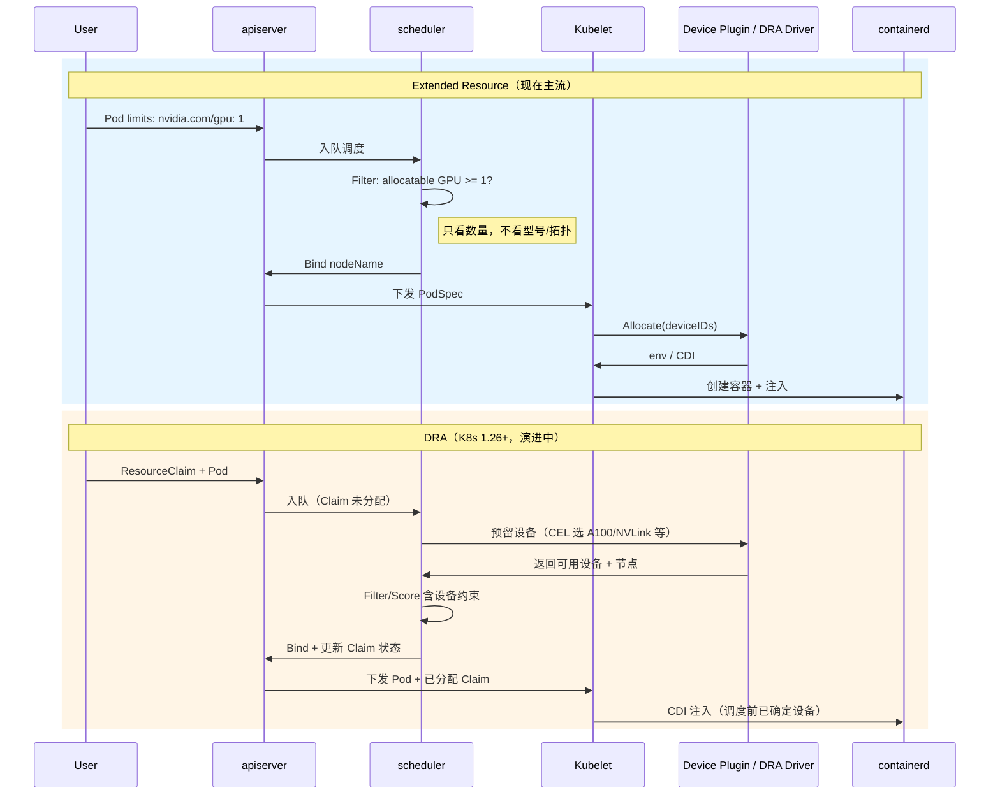

# Extended Resource vs DRA 时序对比

> 同一张 GPU Pod，两种机制下的完整路径

## 并排时序

## 关键差异

| 阶段 | Extended Resource | DRA |
|------|-------------------|-----|
| Pod 声明 | `limits: nvidia.com/gpu: 1` | `ResourceClaim` + `resources.claims` |
| 设备发现 | DP → kubelet → Node status | DRA Driver → ResourceSlice |
| 调度输入 | 节点 GPU **数量** | 设备**属性**（型号、拓扑、CEL） |
| 具体哪张卡 | **调度后** Allocate 决定 | **调度中** Driver 预留 |
| 注入 | DP Allocate → env/CDI | 原生 CDI |

## 生产选型（2026）

- **现在**：Extended Resource + NVIDIA Device Plugin（M1/M2 所学）
- **新集群/强拓扑**：关注 NVIDIA k8s-dra-driver 进展
- **M3 共享**：MIG/Time-Slicing 仍在 Extended Resource 框架下扩展资源名
